# CLAUDE.md

This file provides guidance to Claude Code (claude.ai/code) when working with code in this repository.

## Change Log (Changelog)

### 2025-09-01

- **Architecture Refresh & i18n Enhancement**: Comprehensive project analysis and documentation update
- **Project Version**: Current v2.12.4 with advanced i18next internationalization and enhanced CLI features  
- **Internationalization Upgrade**: Implemented comprehensive i18next system replacing previous language detection approach
- **Module Analysis**: Complete analysis of 7 core modules with enhanced TypeScript architecture and testing coverage
- **Coverage Analysis**: Achieved 88%+ file coverage (200/225 source files) with focus on critical path optimization
- **Documentation Enhancement**: Updated architecture diagrams, enhanced module navigation, and improved cross-platform documentation
- **CLI Enhancement**: Advanced command-line interface with improved error handling and user experience
- **Template System**: Enhanced multilingual template system with professional AI personality styles

### 2025-08-28

- **Architecture Initialization Update**: Comprehensive repository analysis and documentation refresh
- **Project Version**: Current v2.12.2 with enhanced engineering templates and configuration validation
- **Module Analysis**: Identified 7 core modules with 100+ TypeScript files and comprehensive test coverage
- **Coverage Analysis**: Estimated 85%+ file coverage (190/225 source files) with focus on critical paths
- **Documentation Enhancement**: Updated Mermaid diagrams, module navigation, and cross-platform support documentation
- **Templates Expansion**: Enhanced template system with multi-language support and professional output styles

### 2025-08-24

- **Project Version Update**: Updated to v2.11.0 with intelligent IDE detection and common tools workflow
- **Test Directory Reorganization**: Migrated from `test/` to `tests/` for consistency and improved structure
- **ESLint Integration**: Added comprehensive ESLint configuration with @antfu/eslint-config
- **Documentation Synchronization**: Updated documentation to reflect latest code changes and architectural improvements
- **Coverage Analysis Update**: Maintained 63.2% file coverage (158/250 files) with enhanced focus on critical paths

### 2025-08-20

- **AI Context Initialization**: Completed comprehensive repository analysis and documentation generation
- **Module Structure Mapping**: Identified 6 core modules with detailed architecture documentation
- **Coverage Analysis**: Achieved 63.2% file coverage (158/250 files) with focus on critical paths
- **Documentation Enhancement**: Added Mermaid diagrams and module navigation structure
- **Templates Module Documentation**: Created comprehensive documentation for templates module
- **Index Generation**: Updated .claude/index.json with complete project metadata and scan results

## Project Overview

ZCF (Zero-Config Claude-Code Flow) is a CLI tool that automatically configures Claude Code environments. Built with TypeScript and distributed as an npm package, it provides one-click setup for Claude Code including configuration files, API settings, MCP services, and AI workflows. The current version v2.12.4 features advanced i18next internationalization, enhanced engineering templates, intelligent IDE detection, and comprehensive multi-platform support including Termux compatibility.

## Architecture Overview

ZCF follows a modular CLI architecture with strict TypeScript typing, comprehensive i18next-based internationalization, and cross-platform support. The project is built using modern tooling including unbuild, Vitest, ESM-only configuration, and @antfu/eslint-config for code quality. The architecture emphasizes robust error handling, user-friendly interfaces, and extensive testing coverage.

### Module Structure Diagram

```mermaid
graph TD
    A["🚀 ZCF Root (v2.12.4)"] --> B["src/commands"];
    A --> C["src/utils"];
    A --> D["src/i18n"];
    A --> E["src/types"];
    A --> F["src/config"];
    A --> G["templates"];
    A --> H["tests"];

    B --> B1["init.ts - Full initialization"];
    B --> B2["menu.ts - Interactive UI"];
    B --> B3["update.ts - Workflow updates"];
    B --> B4["ccr.ts - Router management"];
    B --> B5["ccu.ts - Usage analysis"];
    B --> B6["check-updates.ts - Tool updates"];

    C --> C1["config.ts - Configuration management"];
    C --> C2["installer.ts - Claude Code installation"];
    C --> C3["mcp.ts - MCP services"];
    C --> C4["platform.ts - Cross-platform support"];
    C --> C5["workflow-installer.ts - Workflow management"];
    C --> C6["ccr/ - CCR integration"];
    C --> C7["cometix/ - Status line tools"];
    C --> C8["tools/ - Tool integration"];

    D --> D1["locales/zh-CN/ - Chinese translations"];
    D --> D2["locales/en/ - English translations"];
    D --> D3["index.ts - i18next system"];
    D --> D4["types.ts - Translation interfaces"];

    E --> E1["workflow.ts - Workflow types"];
    E --> E2["config.ts - Configuration types"];
    E --> E3["ccr.ts - CCR types"];

    F --> F1["workflows.ts - Workflow definitions"];
    F --> F2["mcp-services.ts - MCP configurations"];

    G --> G1["zh-CN/ - Chinese templates"];
    G --> G2["en/ - English templates"];
    G --> G3["common/ - Shared configuration"];
    G --> G4["output-styles/ - AI personalities"];

    H --> H1["commands/ - Command tests"];
    H --> H2["utils/ - Utility tests"];
    H --> H3["unit/ - Unit test suites"];
    H --> H4["integration/ - Integration tests"];
    H --> H5["edge/ - Edge case tests"];

    click B1 "./src/commands/CLAUDE.md" "View commands module"
    click C1 "./src/utils/CLAUDE.md" "View utils module"
    click D1 "./src/i18n/CLAUDE.md" "View i18n module"
    click E1 "./src/types/CLAUDE.md" "View types module"
    click F1 "./src/config/CLAUDE.md" "View config module"
    click G1 "./templates/CLAUDE.md" "View templates module"
    click H1 "./tests/CLAUDE.md" "View tests module"
```



## Module Index

| Module                   | Path            | Description                             | Entry Points                                                        | Test Coverage                   |
| ------------------------ | --------------- | --------------------------------------- | ------------------------------------------------------------------- | ------------------------------- |
| **Commands**             | `src/commands/` | CLI command implementations             | init.ts, menu.ts, update.ts, ccr.ts, ccu.ts, check-updates.ts       | High - dedicated suites         |
| **Utilities**            | `src/utils/`    | Core functionality and platform support | config.ts, installer.ts, mcp.ts, platform.ts, workflow-installer.ts | High - comprehensive unit tests |
| **Internationalization** | `src/i18n/`     | i18next multilingual support (zh-CN/en) | index.ts, locales/                                                   | High - translation validation   |
| **Types**                | `src/types/`    | TypeScript type definitions             | workflow.ts, config.ts, ccr.ts                                      | Implicit through usage          |
| **Configuration**        | `src/config/`   | Workflow and system configurations      | workflows.ts, mcp-services.ts                                       | High - config validation tests  |
| **Templates**            | `templates/`    | Configuration templates and workflows   | common/, zh-CN/, en/, output-styles/                                | Medium - template tests         |
| **Testing**              | `tests/`        | Test suites with core and edge coverage | Unit, integration, edge test files                                  | Self-testing module             |

## CLI Usage

ZCF provides both direct commands and an interactive menu system:

```bash
# Interactive menu (recommended)
npx zcf                    # Opens main menu with all options

# Direct commands
npx zcf i                  # Full initialization
npx zcf u                  # Update workflows only
npx zcf ccr [--lang <en|zh-CN>]  # Claude Code Router management
npx zcf ccu [args...]      # Run ccusage with arguments
npx zcf check-updates [--lang <en|zh-CN>]  # Check tool updates
```

## Running and Development

### Build & Run

```bash
# Development (uses tsx for TypeScript execution)
pnpm dev

# Build for production (uses unbuild)
pnpm build

# Type checking
pnpm typecheck
```

### Code Quality & Linting

```bash
# Run ESLint (uses @antfu/eslint-config)
pnpm lint

# Fix ESLint issues automatically
pnpm lint:fix
```

### Testing Strategy

```bash
# Run all tests
pnpm test

# Run tests in watch mode (for development)
pnpm test:watch

# Run tests with UI
pnpm test:ui

# Generate coverage report
pnpm test:coverage

# Run tests once
pnpm test:run

# Run specific test file
pnpm vitest utils/config.test.ts

# Run tests matching pattern
pnpm vitest --grep "should handle"
```

The project uses Vitest with a layered testing approach:

1. **Core Tests** (`*.test.ts`) - Basic functionality and main flows
2. **Edge Tests** (`*.edge.test.ts`) - Boundary conditions and error scenarios
3. **Coverage Goals**: 80% minimum across lines, functions, branches, and statements

## Development Guidelines

### Core Principles

- **Documentation Language**: Except for README_zh-CN, all code comments and documentation should be written in English
  - Code comments must be in English
  - All documentation files (\*.md) must be in English except README_zh-CN
  - API documentation and inline documentation must use English
  - Git commit messages should be in English

- **Test-Driven Development (TDD)**: All development must follow TDD methodology
  - Write tests BEFORE implementing functionality
  - Follow Red-Green-Refactor cycle: write failing test → implement minimal code → refactor
  - Ensure each function/feature has corresponding test coverage before implementation
  - When writing tests, first verify if relevant test files already exist to avoid unnecessary duplication
  - Minimum 80% coverage required across lines, functions, branches, and statements

- **Internationalization (i18n) Guidelines**:
  - All user-facing prompts, logs, and error messages must support i18n via i18next
  - Use project-wide i18n approach with centralized language management
  - Implement translations consistently across the entire project using namespace-based organization
  - Support both zh-CN and en locales with complete feature parity
  - Use `i18n.t()` function for all translatable strings with proper namespace prefixes
  - Organize translations in logical namespaces (common, cli, menu, errors, etc.)

## Coding Standards

- **ESM-Only**: Project is fully ESM with no CommonJS fallbacks
- **Path Handling**: Uses `pathe` for cross-platform path operations
- **Command Execution**: Uses `tinyexec` for better cross-platform support
- **TypeScript**: Strict TypeScript with explicit type definitions and ESNext configuration
- **Error Handling**: Comprehensive error handling with user-friendly i18n messages
- **Cross-Platform Support**: Special handling for Windows paths, macOS, Linux, and Termux environment
- **Code Formatting**: Uses @antfu/eslint-config for consistent code style with strict rules
- **Testing Organization**: Tests organized in `tests/` directory with unit/integration/edge structure and 80% coverage requirement

## AI Usage Guidelines

### Key Architecture Patterns

1. **Modular Command Structure**: Each command is self-contained with its own options interface and comprehensive error handling
2. **i18next I18N Support**: All user-facing strings support zh-CN and en localization with namespace-based organization
3. **Configuration Merging**: Smart config merging with backup system to preserve user customizations
4. **Cross-Platform Support**: Windows/macOS/Linux/Termux compatibility with platform-specific adaptations
5. **Template System**: Language-specific templates with workflow categorization and AI personality support
6. **IDE Integration**: Intelligent IDE detection and auto-open functionality for git-worktree environments
7. **AI Personality System**: Professional output styles including engineer-professional, laowang-engineer, and nekomata-engineer
8. **Tool Integration**: Comprehensive integration with CCR proxy, CCusage analytics, and Cometix status line tools

### Important Implementation Details

1. **Windows Compatibility**: MCP configurations require special handling for Windows paths with proper escaping
2. **Configuration Backup**: All modifications create timestamped backups in `~/.claude/backup/` for recovery
3. **API Configuration**: Supports both Auth Token (OAuth) and API Key authentication with validation
4. **Workflow System**: Modular workflow installation with dependency resolution and conflict management
5. **CCR Integration**: Claude Code Router proxy management with configuration validation
6. **Auto-Update System**: Automated tool updating for Claude Code, CCR, and CCometixLine with version checking
7. **Common Tools Workflow**: New workflow category with init-project command and related agents for project setup
8. **Enhanced Template System**: Multi-language templates with professional output styles and comprehensive workflow coverage
9. **i18next Integration**: Advanced internationalization with namespace-based translation management and dynamic language switching

### Testing Philosophy

- Extensive mocking for file system operations, external commands, and user prompts with realistic scenarios
- Cross-platform testing with platform detection mocks and environment-specific test cases
- Comprehensive edge case testing for boundary conditions, error scenarios, and recovery mechanisms
- 80% minimum coverage across all metrics with quality-focused test design
- Tests organized in dedicated `tests/` directory with clear categorization and helper functions
- Integration testing for complete workflow scenarios and external tool interactions

## Release & Publishing

```bash
# Create a changeset for version updates
pnpm changeset

# Update package version based on changesets
pnpm version

# Build and publish to npm
pnpm release
```

---

**Important Reminders**:

- Do what has been asked; nothing more, nothing less
- NEVER create files unless absolutely necessary for achieving your goal
- ALWAYS prefer editing an existing file to creating a new one
- NEVER proactively create documentation files unless explicitly requested
- Never save working files, text/mds and tests to the root folder