# CLAUDE.md

This file provides guidance to Claude Code (claude.ai/code) when working with code in this repository.

## Change Log (Changelog)

### 2025-08-20
- **AI Context Initialization**: Completed comprehensive repository analysis and documentation generation
- **Module Structure Mapping**: Identified 6 core modules with detailed architecture documentation  
- **Coverage Analysis**: Achieved 63.2% file coverage (158/250 files) with focus on critical paths
- **Documentation Enhancement**: Added Mermaid diagrams and module navigation structure
- **Templates Module Documentation**: Created comprehensive documentation for templates module
- **Index Generation**: Updated .claude/index.json with complete project metadata and scan results

## Project Overview

ZCF (Zero-Config Claude-Code Flow) is a CLI tool that automatically configures Claude Code environments. It's built with TypeScript and distributed as an npm package. The tool provides one-click setup for Claude Code including configuration files, API settings, MCP services, and AI workflows.

## Architecture Overview

ZCF follows a modular CLI architecture with strict TypeScript typing, comprehensive internationalization, and cross-platform support. The project is built using modern tooling including unbuild, Vitest, and ESM-only configuration.

### Module Structure Diagram

```mermaid
graph TD
    A[ZCF Root] --> B[src/commands];
    A --> C[src/utils];
    A --> D[src/i18n];
    A --> E[src/types];
    A --> F[templates];
    A --> G[tests];
    
    B --> B1[init.ts - Full initialization];
    B --> B2[menu.ts - Interactive UI];
    B --> B3[update.ts - Workflow updates];
    B --> B4[ccr.ts - Router management];
    B --> B5[ccu.ts - Usage analysis];
    B --> B6[check-updates.ts - Tool updates];
    
    C --> C1[config.ts - Configuration management];
    C --> C2[installer.ts - Claude Code installation];
    C --> C3[mcp.ts - MCP services];
    C --> C4[platform.ts - Cross-platform support];
    C --> C5[workflow-installer.ts - Workflow management];
    C --> C6[ccr/ - CCR integration];
    C --> C7[cometix/ - Status line tools];
    
    D --> D1[locales/zh-CN - Chinese translations];
    D --> D2[locales/en - English translations];
    D --> D3[types.ts - Translation interfaces];
    
    E --> E1[workflow.ts - Workflow types];
    E --> E2[config.ts - Configuration types];
    E --> E3[ccr.ts - CCR types];
    
    F --> F1[zh-CN/ - Chinese templates];
    F --> F2[en/ - English templates];
    F --> F3[common/ - Shared configuration];
    
    G --> G1[unit/ - Unit tests];
    G --> G2[integration/ - Integration tests];
    G --> G3[edge/ - Edge case tests];
    
    click B1 "./src/commands/CLAUDE.md" "View commands module"
    click C1 "./src/utils/CLAUDE.md" "View utils module"
    click D1 "./src/i18n/CLAUDE.md" "View i18n module"
    click E1 "./src/types/CLAUDE.md" "View types module"
    click F1 "./templates/CLAUDE.md" "View templates module"
    click G1 "./tests/CLAUDE.md" "View tests module"
```



## Module Index

| Module | Path | Description | Entry Points | Test Coverage |
|--------|------|-------------|--------------|---------------|
| **Commands** | `src/commands/` | CLI command implementations | init.ts, menu.ts, update.ts, ccr.ts, ccu.ts, check-updates.ts | High - dedicated suites |
| **Utilities** | `src/utils/` | Core functionality and platform support | config.ts, installer.ts, mcp.ts, platform.ts, workflow-installer.ts | High - comprehensive unit tests |
| **Internationalization** | `src/i18n/` | Multilingual support (zh-CN/en) | index.ts, types.ts | Medium - translation validation |
| **Types** | `src/types/` | TypeScript type definitions | workflow.ts, config.ts, ccr.ts | Implicit through usage |
| **Templates** | `templates/` | Configuration templates and workflows | common/, zh-CN/, en/ | Medium - template tests |
| **Testing** | `tests/` | Test suites with core and edge coverage | Unit, integration, edge test files | Self-testing module |

## CLI Usage

ZCF provides both direct commands and an interactive menu system:

```bash
# Interactive menu (recommended)
npx zcf                    # Opens main menu with all options

# Direct commands
npx zcf i                  # Full initialization
npx zcf u                  # Update workflows only
npx zcf ccr [--lang <en|zh-CN>]  # Claude Code Router management
npx zcf ccu [args...]      # Run ccusage with arguments
npx zcf check-updates [--lang <en|zh-CN>]  # Check tool updates
```

## Running and Development

### Build & Run

```bash
# Development (uses tsx for TypeScript execution)
pnpm dev

# Build for production (uses unbuild)
pnpm build

# Type checking
pnpm typecheck
```

### Code Quality & Linting

```bash
# Run ESLint (uses @antfu/eslint-config)
pnpm lint

# Fix ESLint issues automatically
pnpm lint:fix
```

### Testing Strategy

```bash
# Run all tests
pnpm test

# Run tests in watch mode (for development)
pnpm test:watch

# Run tests with UI
pnpm test:ui

# Generate coverage report
pnpm test:coverage

# Run tests once
pnpm test:run

# Run specific test file
pnpm vitest utils/config.test.ts

# Run tests matching pattern
pnpm vitest --grep "should handle"
```

The project uses Vitest with a layered testing approach:
1. **Core Tests** (`*.test.ts`) - Basic functionality and main flows
2. **Edge Tests** (`*.edge.test.ts`) - Boundary conditions and error scenarios
3. **Coverage Goals**: 80% minimum across lines, functions, branches, and statements

## Development Guidelines

### Core Principles

- **Documentation Language**: Except for README_zh-CN, all code comments and documentation should be written in English
  - Code comments must be in English
  - All documentation files (*.md) must be in English except README_zh-CN
  - API documentation and inline documentation must use English
  - Git commit messages should be in English

- **Test-Driven Development (TDD)**: All development must follow TDD methodology
  - Write tests BEFORE implementing functionality
  - Follow Red-Green-Refactor cycle: write failing test → implement minimal code → refactor
  - Ensure each function/feature has corresponding test coverage before implementation
  - When writing tests, first verify if relevant test files already exist to avoid unnecessary duplication
  - Minimum 80% coverage required across lines, functions, branches, and statements

- **Internationalization (i18n) Guidelines**:
  - All user-facing prompts, logs, and error messages must support i18n
  - Use project-wide i18n approach instead of single-file language detection
  - Implement translations consistently across the entire project
  - Support both zh-CN and en locales
  - Use `t()` function from `utils/i18n.ts` to get translations
  - Use `format()` function for string interpolation with placeholders

## Coding Standards

- **ESM-Only**: Project is fully ESM with no CommonJS fallbacks
- **Path Handling**: Uses `pathe` for cross-platform path operations
- **Command Execution**: Uses `tinyexec` for better cross-platform support
- **TypeScript**: Strict TypeScript with explicit type definitions
- **Error Handling**: Graceful error handling with user-friendly messages
- **Cross-Platform Support**: Special handling for Windows paths and Termux environment

## AI Usage Guidelines

### Key Architecture Patterns

1. **Modular Command Structure**: Each command is self-contained with its own options interface
2. **I18N Support**: All user-facing strings support zh-CN and en localization
3. **Configuration Merging**: Smart config merging to preserve user customizations
4. **Cross-Platform Support**: Windows/macOS/Linux/Termux compatibility
5. **Template System**: Language-specific templates with workflow categorization

### Important Implementation Details

1. **Windows Compatibility**: MCP configurations require special handling for Windows paths
2. **Configuration Backup**: All modifications create timestamped backups in `~/.claude/backup/`
3. **API Configuration**: Supports both Auth Token (OAuth) and API Key authentication
4. **Workflow System**: Modular workflow installation with dependency resolution
5. **CCR Integration**: Claude Code Router proxy management
6. **Auto-Update System**: Automated tool updating for Claude Code, CCR, and CCometixLine

### Testing Philosophy

- Extensive mocking for file system operations, external commands, and user prompts
- Cross-platform testing with platform detection mocks
- Comprehensive edge case testing for boundary conditions and error scenarios
- 80% minimum coverage across all metrics

## Release & Publishing

```bash
# Create a changeset for version updates
pnpm changeset

# Update package version based on changesets
pnpm version

# Build and publish to npm
pnpm release
```

---

**Important Reminders**:
- Do what has been asked; nothing more, nothing less
- NEVER create files unless absolutely necessary for achieving your goal
- ALWAYS prefer editing an existing file to creating a new one
- NEVER proactively create documentation files unless explicitly requested
- Never save working files, text/mds and tests to the root folder