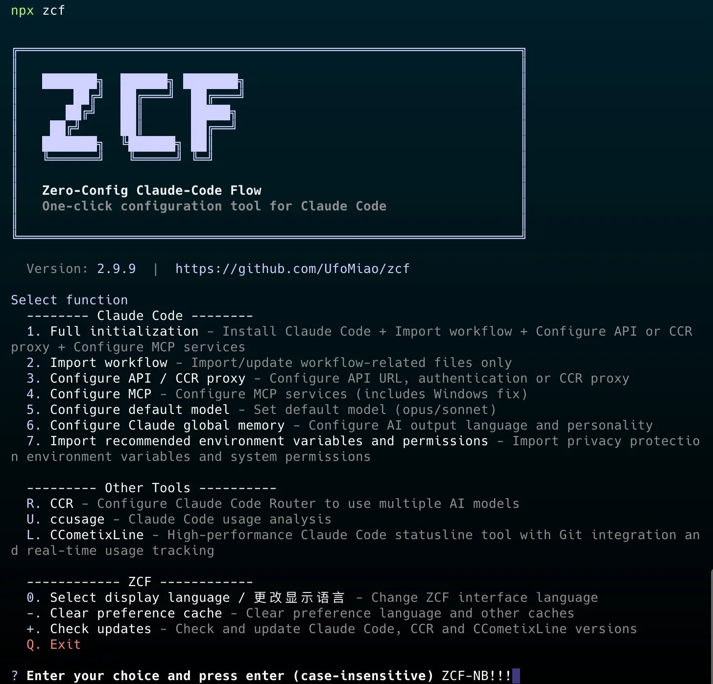

# ZCF - Zero-Config Code Flow

[![npm version][npm-version-src]][npm-version-href]
[![npm downloads][npm-downloads-src]][npm-downloads-href]
[![License][license-src]][license-href]
[![Claude Code][claude-code-src]][claude-code-href]
[![codecov][codecov-src]][codecov-href]
[![JSDocs][jsdocs-src]][jsdocs-href]
[![Ask DeepWiki][deepwiki-src]][deepwiki-href]

[中文](README_zh-CN.md) | **English** | [日本語](README_ja-JP.md) | [Changelog](CHANGELOG.md)

**✨ Quick Links**: [Codex Support](#-codex-support-v300-new) | [BMad Workflow](#-bmad-workflow-v27-new-feature) | [Spec Workflow](#-spec-workflow-v2124-new-feature) | [Open Web Search](#-open-web-search-v2129-new-feature) | [CCR Router](#-ccr-claude-code-router-support-v28-enhanced) | [CCometixLine](#-ccometixline-support-status-bar-tool-v299-new) | [Output Styles](#-ai-output-styles-v212-new-feature)

> Zero-config, one-click setup for Claude Code & Codex with bilingual support, intelligent agent system and personalized AI assistant



## 🚀 Quick Start

### 🎯 Recommended: Use Interactive Menu (v2.0 New)

```bash
npx zcf          # Open interactive menu and choose operations based on your needs
```

Menu options include:

- `1` Full initialization (equivalent to `zcf i`)
- `2` Import workflows (equivalent to `zcf u`)
- `3` Configure API or CCR - API configuration or CCR proxy setup
- `4` Configure MCP - MCP service configuration and management
- `5` Configure default model - Set default model (opus/sonnet/opusplan/custom)
- `6` Configure AI memory - Configure AI output language and global output style
- `7` Configure environment permissions - Import environment variables and permissions
- `R` Claude Code Router management (enhanced in v2.8.1)
- `U` ccusage - Claude Code usage analysis
- `L` CCometixLine - High-performance statusline tool with Git integration and real-time usage tracking (v2.9.9+ new)
- `+` Check updates - Check and update Claude Code, CCR and CCometixLine versions (v2.9.9+ enhanced)
- More features...

#### 🎯 Key Configuration Features

**Model Configuration (Option 5)**: Configure your default Claude model with flexible options:
- **Default**: Let Claude Code automatically choose the best model for each task
- **Opus**: Use Claude-3.5-Opus exclusively (high token consumption, use with caution)
- **OpusPlan**: Use Opus for planning, Sonnet for implementation (recommended balance)
- **Custom**: Specify your own model names for both primary and fast tasks (supports any custom model)

**AI Memory Configuration (Option 6)**: Personalize your AI assistant:
- **AI Output Language**: Set the language for AI responses (Chinese, English, or custom)
- **Global Output Style**: Configure AI personality and response style

### Or, use direct commands:

#### 🆕 First time using Claude Code

```bash
npx zcf i        # Execute full initialization directly: Install Claude Code + Import workflows + Configure API + Set up MCP services
# or
npx zcf → select 1  # Execute full initialization via menu
```

#### 🔄 Already have Claude Code installed

```bash
npx zcf u        # Update workflows only: Quick add AI workflows and command system
# or
npx zcf → select 2  # Execute workflow update via menu
```

> **Note**:
>
> - Since v2.0, `zcf` opens the interactive menu by default, providing a visual operation interface
> - You can choose operations through the menu or use commands directly for quick execution
> - `zcf i` = full initialization, `zcf u` = update workflows only

#### 🌐 Language Support

ZCF supports bilingual operation with automatic language switching for all commands:

```bash
# Use Chinese for all operations
npx zcf --lang zh-CN          # Interactive menu in Chinese
npx zcf init --lang zh-CN      # Initialize with Chinese interface  
npx zcf ccr --allLang zh-CN    # Configure CCR in Chinese

# Language parameter priority (highest to lowest):
# --all-lang > --lang > saved user preference > interactive prompt
```

**Language Parameters:**
- `--lang, -l`: ZCF interface language (applies to all commands)
- `--all-lang, -g`: Set all language parameters at once (most convenient)
- `--config-lang, -c`: Template files language (init/update commands only)
- `--ai-output-lang, -a`: AI assistant output language (init command only)

#### 🤖 Non-interactive Mode

For CI/CD and automated setups, use `--skip-prompt` with parameters:

```bash
# Shorthand version
npx zcf i -s -g zh-CN -t api_key -k "sk-xxx" -u "https://xxx.xxx"

# Complete version
npx zcf i --skip-prompt --all-lang zh-CN --api-type api_key --api-key "sk-xxx" --api-url "https://xxx.xxx"
```

#### Non-interactive Mode Parameters

When using `--skip-prompt`, the following parameters are available:

| Parameter                    | Description                                              | Values                                                                                             | Required                               | Default                                                                                                                          |
| ---------------------------- | -------------------------------------------------------- | -------------------------------------------------------------------------------------------------- | -------------------------------------- | -------------------------------------------------------------------------------------------------------------------------------- |
| `--skip-prompt, -s`          | Skip all interactive prompts                             | -                                                                                                  | Yes (for non-interactive mode)         | -                                                                                                                                |
| `--lang, -l`                 | ZCF display language (applies to all commands)           | `zh-CN`, `en`                                                                                      | No                                     | `en` or user's saved preference                                                                                                  |
| `--config-lang, -c`          | Configuration language (template files language)         | `zh-CN`, `en`                                                                                      | No                                     | `en`                                                                                                                             |
| `--ai-output-lang, -a`       | AI output language                                       | `zh-CN`, `en`, custom string                                                                       | No                                     | `en`                                                                                                                             |
| `--all-lang, -g`             | Set all language parameters (applies to all commands)    | `zh-CN`, `en`, custom string                                                                       | No                                     | - (Priority: allLang > lang > user preference > prompt. Custom string sets AI output language to custom while interaction and config languages remain 'en') |
| `--config-action, -r`        | Config handling                                          | `new`, `backup`, `merge`, `docs-only`, `skip`                                                      | No                                     | `backup`                                                                                                                         |
| `--api-type, -t`             | API configuration type                                   | `auth_token`, `api_key`, `ccr_proxy`, `skip`                                                       | No                                     | `skip`                                                                                                                           |
| `--api-key, -k`              | API key (for both API key and auth token types)          | string                                                                                             | Required when `api-type` is not `skip` | -                                                                                                                                |
| `--api-url, -u`              | Custom API URL                                           | URL string                                                                                         | No                                     | official API                                                                                                                     |
| `--mcp-services, -m`         | MCP services to install (multi-select, comma-separated)  | `context7`, `open-websearch`, `spec-workflow`, `mcp-deepwiki`, `Playwright`, `exa`, or `skip` for none | No                                     | `all`                                                                                                                            |
| `--workflows, -w`            | Workflows to install (multi-select, comma-separated)     | `commonTools`, `sixStepsWorkflow`, `featPlanUx`, `gitWorkflow`, `bmadWorkflow`, or `skip` for none | No                                     | `all`                                                                                                                            |
| `--output-styles, -o`        | Output styles to install (multi-select, comma-separated) | `engineer-professional`, `nekomata-engineer`, `laowang-engineer`, or `skip` for none               | No                                     | `all`                                                                                                                            |
| `--default-output-style, -d` | Default output style                                     | Same as output styles plus built-in: `default`, `explanatory`, `learning`                          | No                                     | `engineer-professional`                                                                                                          |
| `--install-cometix-line, -x` | Install CCometixLine statusline tool                     | `true`, `false`                                                                                    | No                                     | `true`                                                                                                                           |

#### 🤖 Codex Support (v3.0.0+ New)

[Codex](https://www.npmjs.com/package/@openai/codex) is OpenAI's official code generation CLI tool. ZCF now supports complete Codex integration with the same configuration convenience as Claude Code.

**Key Features:**

- **Unified Tool Management**: Switch between Claude Code and Codex seamlessly through ZCF menu
- **Intelligent Configuration**: Automatic Codex CLI installation, API provider setup, and MCP service integration
- **Comprehensive Backup System**: All configuration changes include timestamped backups with recovery capabilities
- **Multi-Provider Support**: Configure multiple API providers (OpenAI, custom endpoints) with easy switching
- **System Prompt Integration**: Install professional AI personalities (Engineer, Nekomata Engineer, Laowang Engineer)
- **Workflow Templates**: Import structured development workflows optimized for code generation tasks
- **Advanced Uninstaller**: Selective removal of Codex components with conflict resolution

**Getting Started with Codex:**

Switch to Codex mode in ZCF main menu:
```bash
npx zcf → Select S  # Switch between Claude Code and Codex
```

Or access Codex features directly:
```bash
# Full Codex initialization
npx zcf → Select 1 (after switching to Codex mode)

# Individual Codex configuration
npx zcf → Select 3  # Configure Codex API providers
npx zcf → Select 4  # Configure Codex MCP services
```

**Configuration Options:**

1. **API Provider Configuration**:
   - **Official Login**: Use OpenAI's official authentication system
   - **Custom Providers**: Configure multiple API endpoints with provider switching
   - **Incremental Management**: Add, edit, or remove providers without affecting existing configuration

2. **System Prompt Styles**:
   - **Engineer Professional**: SOLID, KISS, DRY, YAGNI principles for robust code
   - **Nekomata Engineer**: Cute catgirl engineer with rigorous technical standards
   - **Laowang Engineer**: Grumpy tech style that never tolerates substandard code

3. **Workflow Integration**:
   - **Six-Step Workflow**: Structured development process from research to optimization
   - **Custom Workflows**: Import and configure task-specific development templates

4. **MCP Services**: Full compatibility with existing MCP services including:
   - Context7, Open WebSearch, Spec Workflow
   - DeepWiki, Playwright, EXA search
   - Automatic service configuration with API key management

**File Locations:**

- Configuration: `~/.codex/config.toml`
- Authentication: `~/.codex/auth.json`
- System Prompts: `~/.codex/AGENTS.md`
- Workflows: `~/.codex/prompts/`
- Backups: `~/.codex/backup/`

**Command Line Operations:**

Dedicated command line tool for Codex (v3.0.0+ New):

```bash
# Codex API provider switching
npx zcf config-switch     # Interactive provider selection
npx zcf cs                # Using alias
npx zcf cs provider-name  # Direct switch to specified provider
npx zcf cs --list         # List all available providers
```

**Migration Between Tools:**

ZCF allows seamless switching between Claude Code and Codex while preserving your preferences and workflow configurations. Both tools share the same MCP services and workflow templates for consistent development experience.

#### 🎨 AI Output Styles (v2.12+ New Feature)

ZCF now supports customizable AI output styles to personalize your Claude Code experience:

**Available Output Styles:**

- `engineer-professional`: Professional software engineer following SOLID, KISS, DRY, YAGNI principles
- `nekomata-engineer`: Professional catgirl engineer UFO Nya, combining rigorous engineering with cute catgirl traits
- `laowang-engineer`: Laowang grumpy tech style, never tolerates code errors and non-standard code
- Built-in styles: `default`, `explanatory`, `learning` (always available)

**Features:**

- Install multiple styles and switch between them
- Set global default style for all projects
- Automatic cleanup of legacy personality files
- Template-based customization system

**Usage Tips:**

- Use `/output-style` command to switch project-level output styles anytime
- Or modify global output styles in ZCF menu option 6

**Important:**

- Claude Code version must be greater than 1.0.81 to support output-style. Use `npx zcf check` to update.
- Legacy global memory rules have been migrated to the `engineer-professional` output style, solving issues with excessive token usage and AI forgetting global memory.

#### 🎯 BMad Workflow (v2.7 New Feature)

[BMad](https://github.com/bmad-code-org/BMAD-METHOD) (BMad-Method: Universal AI Agent Framework) is an enterprise-grade workflow system that provides:

- Complete team of specialized AI agents (PO, PM, Architect, Dev, QA, etc.)
- Structured development process with quality gates
- Automatic documentation generation
- Support for both greenfield and brownfield projects

After installation, use `/bmad-init` to initialize the BMad workflow in your project.

#### 📋 Spec Workflow (v2.12.4+ New Feature)

[Spec Workflow](https://github.com/Pimzino/spec-workflow-mcp) is a comprehensive MCP service that provides structured feature development workflow from requirements to implementation:

- **Requirements Analysis**: Structured requirements gathering and documentation
- **Design Phase**: Detailed technical design and architecture planning
- **Task Management**: Automatic task breakdown and progress tracking
- **Implementation Workflow**: Systematic approach from requirements to implementation
- **Interactive Dashboard**: Built-in dashboard for workflow visualization and management
- **Approval System**: Review and approval process for each development phase

The Spec Workflow MCP provides an optional dashboard for workflow visualization. Users can manually launch the dashboard using:
```bash
npx -y @pimzino/spec-workflow-mcp@latest --dashboard
```

Alternatively, you can install the [VS Code extension](https://marketplace.visualstudio.com/items?itemName=Pimzino.spec-workflow-mcp) for integrated workflow management.

**Usage Guide**: For detailed usage instructions and best practices, see the [official Spec Workflow documentation](https://github.com/Pimzino/spec-workflow-mcp/blob/main/README.md#quick-start).

#### 🔍 Open Web Search (v2.12.9+ New Feature)

[Open Web Search](https://github.com/Aas-ee/open-webSearch) is a versatile web search MCP service that provides access to multiple search engines:

- **Multi-Engine Support**: Search across DuckDuckGo, Bing, and Brave search engines
- **Privacy-Focused**: Uses privacy-respecting search engines as defaults
- **Flexible Configuration**: Customizable search engine preferences
- **No API Key Required**: Ready to use without additional authentication
- **Search Aggregation**: Ability to combine results from multiple engines

#### 🚀 CCR (Claude Code Router) Support (v2.8+ Enhanced)

[CCR](https://github.com/musistudio/claude-code-router/blob/main/README.md) is a powerful proxy router that enables:

- **Free Model Access**: Use free AI models (like Gemini, DeepSeek) through Claude Code interface
- **Custom Routing**: Route different types of requests to different models based on your rules
- **Cost Optimization**: Significantly reduce API costs by using appropriate models for different tasks
- **Easy Management**: Interactive menu for CCR configuration and service control
- **Auto Updates**: Automatic version checking and updates for CCR and Claude Code (v2.8.1+)

To access CCR features:

```bash
npx zcf ccr      # Open CCR management menu
# or
npx zcf → select R
```

CCR menu options:

- Initialize CCR - Install and configure CCR with preset providers
- Start UI - Launch CCR web interface for advanced configuration
- Service Control - Start/stop/restart CCR service
- Check Status - View current CCR service status

After CCR setup, ZCF automatically configures Claude Code to use CCR as the API proxy.

**Important Notice for v2.9.9 Users**: If you previously installed CCometixLine using ZCF v2.9.9, please rerun the installation process to ensure that the CCometixLine configuration is correctly added. Run `npx zcf` -> `Select L` -> `Select 1` to add the CCometixLine configuration.


#### 📊 CCometixLine Support (Status Bar Tool) (v2.9.9+ New)

[CCometixLine](https://github.com/Haleclipse/CCometixLine) is a high-performance Rust-based statusline tool that provides:

- **Real-time Usage Tracking**: Monitor Claude Code API usage in real-time
- **Git Integration**: Display Git status and branch information
- **Status Line Display**: Native integration with your terminal statusline
- **Performance Optimized**: Built with Rust for minimal resource usage
- **TUI Configuration**: Interactive terminal UI for customizing themes, segments, and display options
- **Auto Updates**: Included in ZCF's update checking system

CCometixLine menu options (accessible via `npx zcf` → `L`):

- `1` Install or Update - Install or update CCometixLine using npm
- `2` Print Default Configuration - Display current CCometixLine configuration
- `3` Custom Config - TUI Configuration Mode - Interactive terminal UI for customizing settings

> **Important Note for v2.9.9 Users**: If you have previously used ZCF v2.9.9 to set up your environment, please re-run the initialization process to ensure CCometixLine configuration is properly added. Run `npx zcf` and select the appropriate setup option to update your configuration with CCometixLine support.

#### 🚀 Check for updates (v2.8.1+, CCometixLine support v2.9.9+):

```bash
npx zcf check-updates  # Check and update Claude Code, CCR and CCometixLine to latest versions
# or
npx zcf → select +
```

### Setup Process

Full initialization (`npx zcf`) will automatically:

- ✅ Detect and install Claude Code
- ✅ Select AI output language (new feature)
- ✅ Configure API keys or CCR proxy
- ✅ Select and configure MCP services
- ✅ Set up all necessary configuration files

### Usage

After configuration:

- **For first-time project use, strongly recommend running `/init-project` to generate CLAUDE.md for better AI understanding of project architecture**
- `<task description>` - Execute directly without workflow, following SOLID, KISS, DRY, and YAGNI principles, suitable for small tasks like bug fixes
- `/feat <task description>` - Start new feature development, divided into plan and UI phases
- `/workflow <task description>` - Execute complete development workflow, not automated, starts with multiple solution options, asks for user feedback at each step, allows plan modifications, maximum control

> **PS**:
>
> - Both feat and workflow have their advantages, try both to compare
> - Generated documents are located by default at `.claude/xxx.md` in project root, you can add `.claude/` to your project's `.gitignore`

## ✨ ZCF Tool Features

### 🌏 Multi-language Support

- Script interaction language: Controls installation prompts language
- Configuration file language: Determines which configuration set to install (zh-CN/en)
- AI output language: Choose the language for AI responses (supports Chinese, English, and custom languages)
- AI output styles: Support multiple preset styles (Professional Engineer, Nekomata Engineer, Laowang Engineer) for customized experience

### 🔧 Smart Installation

- Auto-detects Claude Code installation status
- Uses npm for automatic installation (ensures compatibility)
- Cross-platform support (Windows/macOS/Linux/WSL/Termux)
- Automatic MCP service configuration
- Smart configuration merging and partial modification support (v2.0 new)
- Enhanced command detection mechanism (v2.1 new)
- Dangerous operation confirmation mechanism (v2.3 new)

### 📦 Complete Configuration

- CLAUDE.md system instructions
- settings.json configuration file
- commands custom commands
- agents AI agent configurations

### 🔐 API Configuration

- Supports two authentication methods:
  - **Auth Token**: For tokens obtained via OAuth or browser login
  - **API Key**: For API keys from Anthropic Console
- Custom API URL support
- Support for manual configuration later
- Partial modification: Update only needed configuration items (v2.0 new)

### 💾 Configuration Management

- Smart backup of existing configurations (all backups saved in ~/.claude/backup/)
- Configuration merge option (v2.0 enhanced: supports deep merge)
- Safe overwrite mechanism
- Automatic backup before MCP configuration changes
- Default model configuration (v2.0 new)
- AI memory management (v2.0 new)
- ZCF cache cleanup (v2.0 new)

## 📖 Usage Instructions

### Interactive Menu (v2.0)

```bash
$ npx zcf

 ZCF - Zero-Config Code Flow

? Select ZCF display language / 选择ZCF显示语言:
  ❯ 简体中文
    English

Select function:
  -------- Claude Code --------
  1. Full initialization - Install Claude Code + Import workflow + Configure API or CCR proxy + Configure MCP services
  2. Import workflow - Import/update workflow-related files only
  3. Configure API - Configure API URL and authentication (supports CCR proxy)
  4. Configure MCP - Configure MCP services (includes Windows fix)
  5. Configure default model - Set default model (opus/sonnet/opusplan/custom)
  6. Configure Claude global memory - Configure AI output language and output styles
  7. Import recommended environment variables and permissions - Import privacy protection environment variables and system permissions

  --------- Other Tools ----------
  R. CCR - Claude Code Router management
  U. ccusage - Claude Code usage analysis
  L. CCometixLine - High-performance statusline tool with Git integration and real-time usage tracking

  ------------ ZCF ------------
  0. Select display language / 更改显示语言 - Change ZCF interface language
  -. Uninstall - Remove Claude Code configurations and tools from system
  +. Check updates - Check and update Claude Code, CCR and CCometixLine versions
  Q. Exit

Enter your choice: _
```

### Full Initialization Flow (Select 1 or use `zcf i`)

```bash
? Select Claude Code configuration language:
  ❯ 简体中文 (zh-CN) - Chinese (easier for Chinese users to customize)
    English (en) - English (recommended, lower token consumption)

? Select AI output language:
  AI will respond to you in this language
  ❯ 简体中文
    English
    Custom
    (Supports Japanese, French, German, and more)

? Claude Code not found. Install automatically? (Y/n)

✔ Claude Code installed successfully

? Existing config detected. How to proceed?
  ❯ Backup and overwrite - Backup existing config to ~/.claude/backup/
    Update docs only - Only update workflows and docs, keep existing API config
    Merge config - Merge with existing config, preserve user customizations
    Skip - Skip configuration update

? Select API authentication method
  ❯ Use Auth Token (OAuth authentication)
    For tokens obtained via OAuth or browser login
    Use API Key (Key authentication)
    For API keys from Anthropic Console
    Configure CCR Proxy (Claude Code Router)
    Use free models and custom routing to reduce costs and explore the possibilities of Claude Code
    Skip (configure manually later)

? Enter API URL: https://api.anthropic.com
? Enter Auth Token or API Key: xxx

? Select output styles to install:
  ❯ Engineer Professional - Professional software engineer following SOLID, KISS, DRY, YAGNI principles
    Nekomata Engineer - Professional catgirl engineer UFO Nya, combining rigorous engineering with cute catgirl traits
    Laowang Grumpy Tech - Laowang grumpy tech style, never tolerates code errors and non-standard code

? Select global default output style:
  ❯ Engineer Professional

? Configure MCP services? (Y/n)

? Select MCP services to install:
  ❯ context7 - Get latest library and framework documentation
    mcp-deepwiki - Access deepwiki.com knowledge base
    Playwright - Browser automation and web testing
    exa - Advanced search and enterprise research tools

? Select workflows to install:
  ❯ Common Tools Workflow - init-project and related agents
    Six Steps Workflow - Complete six-stage development process
    Feature Planning UX - Complete feature development lifecycle
    Git Workflow - Git operations and branch management
    BMad Workflow - AI-driven agile development methodology

? Install CCometixLine statusline tool? (Y/n)

✔ Setup complete! Claude Code environment is ready
```

✔ All config files backed up to ~/.claude/backup/xxx
✔ Config files copied to ~/.claude

? Select workflows to install (space to select, enter to confirm)
❯ ◉ Common Tools (init-project + init-architect + get-current-datetime) - Essential project initialization and utility commands
◉ Six Steps Workflow (workflow) - Complete 6-phase development process
◉ Feature Planning and UX Design (feat + planner + ui-ux-designer) - Structured feature development
◉ Git Commands (commit + rollback + cleanBranches + worktree) - Streamlined Git operations
◉ BMAD-Method Extension Installer - Enterprise agile development workflow

✔ Installing workflows...
✔ Installed command: zcf/workflow.md
✔ Installed command: zcf/feat.md
✔ Installed agent: zcf/plan/planner.md
✔ Installed agent: zcf/plan/ui-ux-designer.md
✔ Installed command: zcf/git/git-commit.md
✔ Installed command: zcf/git/git-rollback.md
✔ Installed command: zcf/git/git-cleanBranches.md
✔ Installed command: zcf/git/git-worktree.md
✔ Installed command: zcf/bmad-init.md
✔ Workflow installation successful

✔ API configured

? Configure MCP services? (Y/n)

? Select MCP services to install (space to select, enter to confirm)
❯ ◯ Install all
◯ Context7 Documentation Query - Query latest library docs and code examples
◯ DeepWiki - Query GitHub repository docs and examples
◯ Playwright Browser Control - Direct browser automation control
◯ Exa AI Search - Web search using Exa AI

? Enter Exa API Key (get from https://dashboard.exa.ai/api-keys)

✔ MCP services configured

🎉 Setup complete! Use 'claude' command to start.

````

### Command Line Options

#### Commands Quick Reference

| Command             | Alias   | Description                                                                           |
| ------------------- | ------- | ------------------------------------------------------------------------------------- |
| `zcf`               | -       | Show interactive menu (v2.0 default command)                                          |
| `zcf init`          | `zcf i` | Initialize Claude Code configuration                                                  |
| `zcf update`        | `zcf u` | Update workflow-related md files with backup                                          |
| `zcf ccu`           | -       | Run Claude Code usage analysis tool - [ccusage](https://github.com/ryoppippi/ccusage) |
| `zcf ccr`           | -       | Open CCR (Claude Code Router) management menu                                         |
| `zcf config-switch` | `zcf cs` | Codex API provider switching tool - Switch between official login and custom providers |
| `zcf uninstall`     | -       | Interactive uninstall tool for Claude Code configurations and tools                   |
| `zcf check-updates` | -       | Check and update Claude Code, CCR and CCometixLine versions                           |

#### Common Options

```bash
# Specify configuration language
npx zcf --config-lang zh-CN
npx zcf -c zh-CN            # Using short option

# Force overwrite existing configuration
npx zcf --force
npx zcf -f                 # Using short option

# Update workflow-related md files with backup (preserve API and MCP configs)
npx zcf u                  # Using update command
npx zcf update             # Full command

# Show help information
npx zcf --help
npx zcf -h

# Show version
npx zcf --version
npx zcf -v
````

#### Usage Examples

```bash
# Show interactive menu (default)
npx zcf

# First-time installation, complete initialization
npx zcf i
npx zcf init              # Full command

# Update workflow-related md files with backup, keep API and MCP configs
npx zcf u
npx zcf update            # Full command

# Force reinitialize with Chinese config
npx zcf i --config-lang zh-CN --force
npx zcf i -c zh-CN -f      # Using short options

# Update to English prompts (lower token consumption)
npx zcf u --config-lang en
npx zcf u -c en            # Using short option

# Run Claude Code usage analysis tool (powered by ccusage)
npx zcf ccu               # Daily usage (default), or use: monthly, session, blocks

# Codex API provider switching (v3.0.0+ New)
npx zcf config-switch     # Interactive provider selection
npx zcf cs                # Using alias
npx zcf cs provider-name  # Direct switch to specified provider
npx zcf cs --list         # List all available providers
```

## 📁 Project Structure

```
zcf/
├── README.md              # Documentation
├── package.json           # npm package configuration
├── bin/
│   └── zcf.mjs           # CLI entry point
├── src/                  # Source code
│   ├── cli.ts           # CLI main logic
│   ├── commands/        # Command implementations
│   ├── utils/           # Utility functions
│   └── constants.ts     # Constant definitions
├── templates/            # Configuration templates
│   ├── CLAUDE.md        # Project level config (v2.0 new)
│   ├── settings.json    # Base configuration (with privacy env vars)
│   ├── en/              # English version
│   │   ├── rules.md     # Core principles (formerly CLAUDE.md)
│   │   ├── output-styles/ # AI output styles (v2.12+ new)
│   │   ├── mcp.md       # MCP services guide (v2.0 new)
│   │   ├── agents/      # AI agents
│   │   └── commands/    # Command definitions
│   └── zh-CN/           # Chinese version
│       └── ... (same structure)
└── dist/                # Build output
```

## ✨ Core Features (v2.0 Enhanced)

### 🤖 Professional Agents

- **Task Planner**: Breaks down complex tasks into executable steps
- **UI/UX Designer**: Provides professional interface design guidance
- **AI Personality**: Support multiple preset personalities and custom (v2.0 new)
- **BMad Team** (New): Complete agile development team including:
  - Product Owner (PO): Requirements elicitation and prioritization
  - Project Manager (PM): Planning and coordination
  - System Architect: Technical design and architecture
  - Developer: Implementation and coding
  - QA Engineer: Testing and quality assurance
  - Scrum Master (SM): Process facilitation
  - Business Analyst: Requirements analysis
  - UX Expert: User experience design

### ⚡ Command System

- **Feature Development** (`/feat`): Structured new feature development
- **Workflow** (`/workflow`): Complete six-phase development workflow
- **Git Commands**: Streamlined Git operations
  - `/git-commit`: Smart commit with automatic staging and message generation
  - `/git-rollback`: Safely rollback to previous commits with backup
  - `/git-cleanBranches`: Clean up merged branches and maintain repository hygiene
  - `/git-worktree`: Manage Git worktrees with IDE integration and content migration
- **BMad Workflow** (`/bmad-init`): Initialize BMad workflow for enterprise development
  - Supports both greenfield (new projects) and brownfield (existing projects)
  - Provides comprehensive templates for PRDs, architecture docs, and user stories
  - Integrated quality gates and checklist system

### 🔧 Smart Configuration

- API key management (supports partial modification)
- Fine-grained permission control
- Multiple Claude model support (configurable default model)
- Interactive menu system (v2.0 new)
- AI memory management (v2.0 new)

## 🎯 Development Workflow

### Six-Phase Workflow

1. [Mode: Research] - Understand requirements
2. [Mode: Ideate] - Design solutions
3. [Mode: Plan] - Create detailed plan
4. [Mode: Execute] - Implement development
5. [Mode: Optimize] - Improve quality
6. [Mode: Review] - Final assessment

## 🛠️ Development

```bash
# Clone the project
git clone https://github.com/UfoMiao/zcf.git
cd zcf

# Install dependencies (using pnpm)
pnpm install

# Build project
pnpm build

# Local testing
node bin/zcf.mjs
```

## 💡 Best Practices

1. **Task Breakdown**: Keep tasks independent and testable
2. **Code Quality**: Follow SOLID, KISS, DRY, and YAGNI principles
3. **Documentation Management**: The plan will be stored in the `.claude/plan/` directory at the project root

## 🔧 Troubleshooting

If you encounter issues:

1. Re-run `npx zcf` to reconfigure
2. Check configuration files in `~/.claude/` directory
3. Ensure Claude Code is properly installed
4. If paths contain spaces, ZCF will automatically handle quote wrapping
5. Use ripgrep (`rg`) preferentially for file searching for better performance

### Cross-Platform Support

#### Windows Platform

ZCF fully supports Windows platform:

- **Auto-detection**: Automatically uses compatible `cmd /c npx` format on Windows systems
- **Config repair**: Existing incorrect configurations are automatically fixed during updates
- **Zero-config**: Windows users don't need any extra steps, same experience as macOS/Linux

If you encounter MCP connection issues on Windows, running `npx zcf` will automatically fix the configuration format.

#### WSL Support (v2.12.12+ new)

ZCF now provides comprehensive support for Windows Subsystem for Linux (WSL):

- **Smart Detection**: Multi-layered WSL environment detection using environment variables, system files, and mount points
- **Distribution Recognition**: Automatically identifies WSL distribution (Ubuntu, Debian, etc.) for optimized configuration
- **Seamless Installation**: Native Linux-style installation experience within WSL environment
- **Path Management**: Intelligent handling of WSL-specific configuration paths and file locations

If running in WSL, ZCF will automatically detect the environment and display appropriate installation messages.

#### Termux Support (v2.1 new)

ZCF now supports running in Android Termux environment:

- **Auto-adaptation**: Automatically detects Termux environment and uses compatible configuration
- **Enhanced detection**: Intelligently identifies available commands, ensuring normal operation in restricted environments
- **Full functionality**: Enjoy the same complete features in Termux as on desktop systems

### Security Features (v2.3 new)

#### Dangerous Operation Confirmation Mechanism

To protect user data security, the following operations require explicit confirmation:

- **File System**: Delete files/directories, bulk modifications, move system files
- **Code Commits**: `git commit`, `git push`, `git reset --hard`
- **System Config**: Modify environment variables, system settings, permissions
- **Data Operations**: Database deletions, schema changes, bulk updates
- **Network Requests**: Send sensitive data, call production APIs
- **Package Management**: Global install/uninstall, update core dependencies

## 🙏 Acknowledgments

This project is inspired by and incorporates the following open source projects:

- [LINUX DO - The New Ideal Community](https://linux.do)
- [CCR](https://github.com/musistudio/claude-code-router)
- [CCometixLine](https://github.com/Haleclipse/CCometixLine)
- [ccusage](https://github.com/ryoppippi/ccusage)
- [BMad Method](https://github.com/bmad-code-org/BMAD-METHOD)

Thanks to these community contributors for sharing!

## ❤️ Support & Sponsorship

If you find this project helpful, please consider sponsoring its development. Your support is greatly appreciated!

[](https://ko-fi.com/UfoMiao)

<table>
  <tr>
    <td></td>
    <td></td>
  </tr>
</table>

### Our Sponsors

A huge thank you to all our sponsors for their generous support!

- Tc (first sponsor)
- Argolinhas (first ko-fi sponsor ٩(•̤̀ᵕ•̤́๑))
- r\*r (first anonymous sponsor🤣)
- \*\*康 (first KFC sponsor🍗)
- 16°C coffee (My best friend🤪, offered Claude Code max $200 package)

## 📄 License

[MIT License](LICENSE)

---

If this project helps you, please give me a ⭐️ Star!

[](https://star-history.com/#UfoMiao/zcf&Date)

<!-- Badges -->

[npm-version-src]: https://img.shields.io/npm/v/zcf?style=flat&colorA=080f12&colorB=1fa669
[npm-version-href]: https://npmjs.com/package/zcf
[npm-downloads-src]: https://img.shields.io/npm/dm/zcf?style=flat&colorA=080f12&colorB=1fa669
[npm-downloads-href]: https://npmjs.com/package/zcf
[license-src]: https://img.shields.io/github/license/ufomiao/zcf.svg?style=flat&colorA=080f12&colorB=1fa669
[license-href]: https://github.com/ufomiao/zcf/blob/main/LICENSE
[claude-code-src]: https://img.shields.io/badge/Claude-Code-1fa669?style=flat&colorA=080f12&colorB=1fa669
[claude-code-href]: https://claude.ai/code
[codecov-src]: https://codecov.io/gh/UfoMiao/zcf/graph/badge.svg?token=HZI6K4Y7D7&style=flat&colorA=080f12&colorB=1fa669
[codecov-href]: https://codecov.io/gh/UfoMiao/zcf
[jsdocs-src]: https://img.shields.io/badge/jsdocs-reference-1fa669?style=flat&colorA=080f12&colorB=1fa669
[jsdocs-href]: https://www.jsdocs.io/package/zcf
[deepwiki-src]: https://img.shields.io/badge/Ask-DeepWiki-1fa669?style=flat&colorA=080f12&colorB=1fa669
[deepwiki-href]: https://deepwiki.com/UfoMiao/zcf
