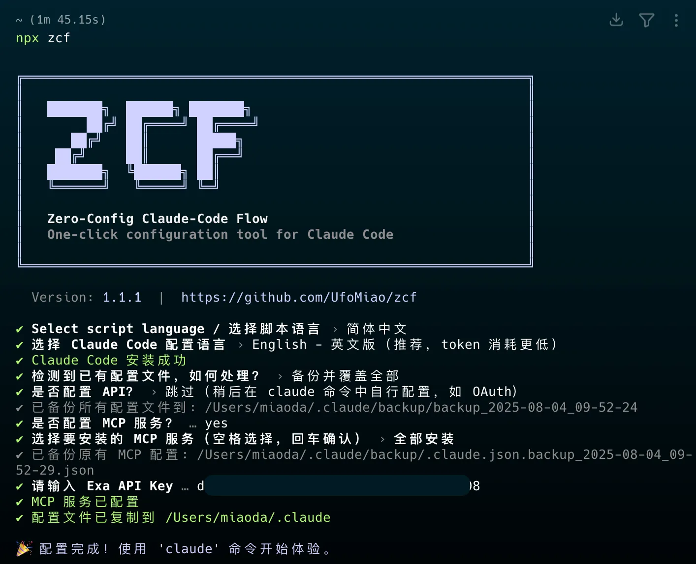

# ZCF - Zero-Config Claude-Code Flow

[![npm version][npm-version-src]][npm-version-href]
[![npm downloads][npm-downloads-src]][npm-downloads-href]
[![License][license-src]][license-href]
[![Claude Code][claude-code-src]][claude-code-href]
[![codecov][codecov-src]][codecov-href]
[![JSDocs][jsdocs-src]][jsdocs-href]
[![Ask DeepWiki][deepwiki-src]][deepwiki-href]

**中文** | [English](README.md) | [日本語](README_ja-JP.md) | [更新日志](CHANGELOG.md)

> 零配置，一键搞定 Claude Code 环境设置 - 支持中英文双语配置、智能代理系统和个性化 AI 助手



## 🚀 快速开始

### 🎯 推荐：使用交互式菜单（v2.0 新增）

```bash
npx zcf          # 打开交互式菜单，根据你的需求选择操作
```

菜单选项包括：

- `1` 完整初始化（等同于 `zcf i`）
- `2` 导入工作流（等同于 `zcf u`）
- `3` 配置 API 或 CCR - API 配置或 CCR 代理设置
- `4` 配置 MCP - MCP 服务配置和管理
- `5` 配置默认模型 - 设置默认模型（opus/sonnet/opusplan/自定义）
- `6` 配置 AI 记忆 - 配置 AI 输出语言和全局输出风格
- `7` 配置环境权限 - 导入环境变量和权限设置
- `R` Claude Code Router 管理（v2.8.1 增强）
- `U` ccusage - Claude Code 用量分析
- `L` CCometixLine - 基于 Rust 的高性能状态栏工具，集成 Git 信息和实时使用量跟踪（v2.9.9+ 新增）
- `+` 检查更新 - 检查并更新 Claude Code、CCR 和 CCometixLine 的版本（v2.9.9+ 增强）
- 更多功能选项...

#### 🎯 核心配置功能

**模型配置（选项 5）**：灵活配置您的默认 Claude 模型：
- **默认**：让 Claude Code 为每个任务自动选择最佳模型
- **Opus**：专门使用 Claude-3.5-Opus（高 token 消耗，请谨慎使用）
- **OpusPlan**：规划时使用 Opus，实现时使用 Sonnet（推荐平衡选择）
- **自定义**：为主要任务和快速任务指定您自己的模型名称（支持任何自定义模型）

**AI 记忆配置（选项 6）**：个性化您的 AI 助手：
- **AI 输出语言**：设置 AI 回复的语言（中文、英文或自定义）
- **全局输出风格**：配置 AI 个性和回复风格

### 或者，直接使用命令：

#### 🆕 首次使用 Claude Code

```bash
npx zcf i        # 直接执行完整初始化：安装 Claude Code + 导入工作流 + 配置 API 或 CCR 代理 + 设置 MCP 服务
# 或
npx zcf → 选择 1  # 通过菜单执行完整初始化
```

#### 🔄 已有 Claude Code 环境

```bash
npx zcf u        # 仅更新工作流：快速添加 AI 工作流和命令系统
# 或
npx zcf → 选择 2  # 通过菜单执行工作流更新
```

> **提示**：
>
> - v2.0 起，`zcf` 默认打开交互式菜单，提供可视化操作界面
> - 你可以通过菜单选择操作，也可以直接使用命令快捷执行
> - `zcf i` = 完整初始化，`zcf u` = 仅更新工作流

#### 🌐 多语言支持

ZCF 支持双语操作，所有命令自动进行语言切换：

```bash
# 使用中文进行所有操作
npx zcf --lang zh-CN          # 中文交互菜单
npx zcf init --lang zh-CN      # 中文界面初始化
npx zcf ccr --allLang zh-CN    # 中文配置 CCR

# 语言参数优先级（由高到低）：
# --all-lang > --lang > 用户保存的偏好 > 交互提示
```

**语言参数说明：**
- `--lang, -l`：ZCF 界面语言（适用于所有命令）
- `--all-lang, -g`：一次性设置所有语言参数（最便捷）
- `--config-lang, -c`：模板文件语言（仅 init/update 命令）
- `--ai-output-lang, -a`：AI 助手输出语言（仅 init 命令）

#### 🤖 非交互模式

适用于 CI/CD 和自动化场景，使用 `--skip-prompt` 配合参数：

```bash
# 缩写版
npx zcf i -s -g zh-CN -t api_key -k "sk-xxx" -u "https://xxx.xxx"

# 完整版
npx zcf i --skip-prompt --all-lang zh-CN --api-type api_key --api-key "sk-xxx" --api-url "https://xxx.xxx"
```

#### 非交互模式参数说明

使用 `--skip-prompt` 时，可用的参数：

| 参数                         | 说明                                    | 可选值                                                                                                 | 是否必需                      | 默认值                                                                                 |
| ---------------------------- | --------------------------------------- | ------------------------------------------------------------------------------------------------------ | ----------------------------- | -------------------------------------------------------------------------------------- |
| `--skip-prompt, -s`          | 跳过所有交互提示                        | -                                                                                                      | 是（非交互模式必需）          | -                                                                                      |
| `--lang, -l`                 | ZCF 显示语言（适用于所有命令）           | `zh-CN`, `en`                                                                                          | 否                            | `en` 或用户保存的偏好                                                                 |
| `--config-lang, -c`          | 配置文件语言（模板文件语言）            | `zh-CN`, `en`                                                                                          | 否                            | `en`                                                                                   |
| `--ai-output-lang, -a`       | AI 输出语言                             | `zh-CN`, `en`, 自定义字符串                                                                            | 否                            | `en`                                                                                   |
| `--all-lang, -g`             | 统一设置所有语言参数（适用于所有命令）  | `zh-CN`, `en`, 自定义字符串                                                                            | 否                            | -（优先级：allLang > lang > 用户偏好 > 提示。自定义字符串时，AI 输出语言为自定义，交互和配置语言为 en） |
| `--config-action, -r`        | 配置处理方式                            | `new`, `backup`, `merge`, `docs-only`, `skip`                                                          | 否                            | `backup`                                                                               |
| `--api-type, -t`             | API 配置类型                            | `auth_token`, `api_key`, `ccr_proxy`, `skip`                                                           | 否                            | `skip`                                                                                 |
| `--api-key, -k`              | API 密钥（用于 API 密钥和认证令牌类型） | 字符串                                                                                                 | `api-type` 不为 `skip` 时必需 | -                                                                                      |
| `--api-url, -u`              | 自定义 API URL                          | URL 字符串                                                                                             | 否                            | 官方 API                                                                               |
| `--mcp-services, -m`         | 要安装的 MCP 服务（多选，逗号分隔）     | `context7`, `open-websearch`, `spec-workflow`, `mcp-deepwiki`, `Playwright`, `exa`, 或 `skip` 表示跳过全部 | 否                            | `all`                                                                                  |
| `--workflows, -w`            | 要安装的工作流（多选，逗号分隔）        | `commonTools`, `sixStepsWorkflow`, `featPlanUx`, `gitWorkflow`, `bmadWorkflow`, 或 `skip` 表示跳过全部 | 否                            | `all`                                                                                  |
| `--output-styles, -o`        | 要安装的输出风格（多选，逗号分隔）      | `engineer-professional`, `nekomata-engineer`, `laowang-engineer`，或 `skip` 表示不安装                 | 否                            | `all`                                                                                  |
| `--default-output-style, -d` | 默认输出风格                            | 同输出风格选项，还包括内置风格：`default`, `explanatory`, `learning`                                   | 否                            | `engineer-professional`                                                                |
| `--install-cometix-line, -x` | 安装 CCometixLine 状态栏工具            | `true`, `false`                                                                                        | 否                            | `true`                                                                                 |

#### 🎨 AI 输出风格（v2.12+ 新功能）

ZCF 现在支持可定制的 AI 输出风格，个性化你的 Claude Code 体验：

**可用的输出风格：**

- `engineer-professional`：专业软件工程师，遵循 SOLID、KISS、DRY、YAGNI 原则
- `nekomata-engineer`：专业猫娘工程师 幽浮喵，结合严谨工程技术与可爱猫娘特质
- `laowang-engineer`：老王暴脾气技术流，绝不容忍代码错误和不规范代码
- 内置样式：`default`、`explanatory`、`learning`（始终可用）

**功能特性：**

- 安装多个样式并在它们之间切换
- 为所有项目设置全局默认样式
- 自动清理旧版个性化配置文件
- 基于模板的自定义系统

**使用提示：**

- 可使用 `/output-style` 命令随时切换项目级的输出风格
- 或在 ZCF 菜单第 6 项中修改全局输出风格

**重要提示：**

- Claude Code 版本需要大于 1.0.81 才支持 output-style，可使用 `npx zcf check` 进行更新。
- 旧版的全局记忆规则已迁移到 `专业软件工程师` 输出风格中，解决了占用过多 token 以及 AI 容易忘记全局记忆的问题。

#### 🎯 BMad 工作流（v2.7 新功能）

[BMad](https://github.com/bmad-code-org/BMAD-METHOD)（BMad-Method: Universal AI Agent Framework）是企业级的工作流系统，提供：

- 完整的专业 AI 代理团队（PO、PM、架构师、开发、QA 等）
- 结构化的开发流程与质量关卡
- 自动化文档生成
- 支持全新项目（greenfield）和现有项目（brownfield）

安装后，使用 `/bmad-init` 在项目中初始化 BMad 工作流。

#### 📋 Spec 工作流（v2.12.4+ 新功能）

[Spec 工作流](https://github.com/Pimzino/spec-workflow-mcp) 是一个综合性的 MCP 服务，提供从需求到实现的结构化特性开发工作流程：

- **需求分析**：结构化需求收集和文档编写
- **设计阶段**：详细的技术设计和架构规划
- **任务管理**：自动任务拆解和进度跟踪
- **实施工作流**：从需求到实现的系统化方法
- **交互式仪表板**：内置的工作流可视化和管理仪表板
- **审批系统**：每个开发阶段的评审和审批流程

Spec 工作流 MCP 提供可选的工作流可视化仪表板。用户可以手动启动仪表板：
```bash
npx -y @pimzino/spec-workflow-mcp@latest --dashboard
```

或者安装 [VS Code 扩展](https://marketplace.visualstudio.com/items?itemName=Pimzino.spec-workflow-mcp) 以获得集成的工作流管理功能。

**使用指南**：详细使用说明和最佳实践，请参阅 [Spec 工作流官方文档](https://github.com/Pimzino/spec-workflow-mcp/blob/main/README.md#quick-start)。

#### 🔍 开放网页搜索（v2.12.9+ 新功能）

[开放网页搜索](https://github.com/Aas-ee/open-webSearch) 是一个多功能的网页搜索 MCP 服务，提供多种搜索引擎访问：

- **多引擎支持**：支持 DuckDuckGo、Bing 和 Brave 搜索引擎
- **隐私保护**：默认使用注重隐私的搜索引擎
- **灵活配置**：可自定义搜索引擎偏好设置
- **无需 API 密钥**：开箱即用，无需额外认证
- **搜索聚合**：支持合并多个引擎的搜索结果

#### 🚀 CCR (Claude Code Router) 支持（v2.8+ 增强版）

[CCR](https://github.com/musistudio/claude-code-router/blob/main/README_zh.md) 是一个强大的代理路由器，可以实现：

- **免费模型接入**：通过 Claude Code 界面使用免费 AI 模型（如 Gemini、DeepSeek）
- **自定义路由**：根据规则将不同类型的请求路由到不同的模型
- **成本优化**：通过为不同任务使用合适的模型，显著降低 API 成本
- **便捷管理**：提供交互式菜单进行 CCR 配置和服务控制
- **自动更新**：CCR 和 Claude Code 的自动版本检查和更新（v2.8.1+）

访问 CCR 功能：

```bash
npx zcf ccr      # 打开 CCR 管理菜单
# 或
npx zcf → 选择 R
```

CCR 菜单选项：

- 初始化 CCR - 安装并配置 CCR，支持预设提供商
- 启动 UI - 启动 CCR Web 界面进行高级配置
- 服务控制 - 启动/停止/重启 CCR 服务
- 检查状态 - 查看当前 CCR 服务状态

CCR 设置完成后，ZCF 会自动配置 Claude Code 使用 CCR 作为 API 代理。

> **v2.9.1 版本用户重要提示**：如果您之前使用过 ZCF v2.9.1 版本初始化 CCR，请重新执行 CCR 初始化流程，以确保安装正确的 `@musistudio/claude-code-router` 包。v2.9.1 版本中存在包名错误问题，该问题已在后续版本中修复。

#### 📊 CCometixLine 支持（状态栏工具）（v2.9.9+ 新增）

[CCometixLine](https://github.com/Haleclipse/CCometixLine) 是一个基于 Rust 的高性能状态栏工具，提供：

- **实时用量追踪**：实时监控 Claude Code API 使用情况
- **Git 集成**：显示 Git 状态和分支信息
- **状态栏显示**：与终端状态栏原生集成
- **性能优化**：使用 Rust 构建，资源消耗极低
- **TUI 配置界面**：交互式终端界面，可自定义主题、分段显示和显示选项
- **自动更新**：已集成到 ZCF 的更新检查系统

CCometixLine 菜单选项（通过 `npx zcf` → `L` 访问）：

- `1` 安装或更新 - 使用 npm 安装或更新 CCometixLine
- `2` 打印默认配置 - 显示当前 CCometixLine 配置
- `3` 自定义配置 - TUI 配置模式 - 交互式终端界面，用于自定义设置

> **v2.9.9 版本用户重要提示**：如果您之前使用过 ZCF v2.9.9 版本安装 CCometixLine，请重新运行一次安装流程，以确保 CCometixLine 配置被正确添加。运行 `npx zcf`->`选择 L`->`选择 1`，添加 CCometixLine 配置。

#### 🚀 检查更新（v2.8.1+，CCometixLine 支持 v2.9.9+）：

```bash
npx zcf check-updates  # 检查并更新 Claude Code、CCR 和 CCometixLine 到最新版本
# 或
npx zcf → 选择 +
```

### 初始化流程

完整初始化（`npx zcf`）会自动：

- ✅ 检测并安装 Claude Code
- ✅ 选择 AI 输出语言（新增）
- ✅ 配置 API 密钥或 CCR 代理
- ✅ 选择并配置 MCP 服务
- ✅ 设置所有必要的配置文件

### 使用方式

配置完成后：

- **项目第一次使用强烈建议先运行 `/init-project` 进行层级初始化，生成 CLAUDE.md 便于 AI 理解项目架构**
- `<任务描述>` - 不使用任何工作流直接执行，会遵循 SOLID、KISS、DRY 和 YAGNI 原则，适合修复 Bug 等小任务
- `/feat <任务描述>` - 开始新功能开发，分为 plan 和 ui 两个阶段
- `/workflow <任务描述>` - 执行完整开发工作流，不是自动化，开始会给出多套方案，每一步会询问用户意见，可随时修改方案，掌控力 MAX

> **PS**:
>
> - feat 和 workflow 这两套各有优势，可以都试试比较一下
> - 生成的文档位置默认都是项目根目录下的 `.claude/xxx.md`，可以把 `.claude/` 加入项目的 `.gitignore` 里

## ✨ ZCF 工具特性

### 🌏 多语言支持

- 脚本交互语言：控制安装过程的提示语言
- 配置文件语言：决定安装哪套配置文件（zh-CN/en）
- AI 输出语言：选择 AI 回复使用的语言（支持简体中文、English 及自定义语言）
- AI 输出风格：支持多种预设风格（专业工程师、猫娘工程师、老王工程师）个性化体验

### 🔧 智能安装

- 自动检测 Claude Code 安装状态
- 使用 npm 进行自动安装（确保兼容性）
- 跨平台支持（Windows/macOS/Linux/Termux）
- 自动配置 MCP 服务
- 智能配置合并和部分修改支持（v2.0 新增）
- 增强的命令检测机制（v2.1 新增）
- 危险操作确认机制（v2.3 新增）

### 📦 完整配置

- CLAUDE.md 系统指令
- settings.json 设置文件
- commands 自定义命令
- agents AI 代理配置

### 🔐 API 配置

- 支持两种认证方式：
  - **Auth Token**：适用于通过 OAuth 或浏览器登录获取的令牌
  - **API Key**：适用于从 Anthropic Console 获取的 API 密钥
- 自定义 API URL 支持
- 支持稍后在 claude 命令中配置
- 部分修改功能：仅更新需要的配置项（v2.0 新增）

### 💾 配置管理

- 智能备份现有配置（所有备份保存在 ~/.claude/backup/）
- 配置合并选项（v2.0 增强：支持深度合并）
- 安全的覆盖机制
- MCP 配置修改前自动备份
- 默认模型配置（v2.0 新增）
- AI 记忆管理（v2.0 新增）
- ZCF 缓存清理（v2.0 新增）

## 📖 使用说明

### 交互式菜单（v2.0）

```bash
$ npx zcf

 ZCF - Zero-Config Claude-Code Flow

? Select ZCF display language / 选择ZCF显示语言:
  ❯ 简体中文
    English

请选择功能:
  -------- Claude Code --------
  1. 完整初始化 - 安装 Claude Code + 导入工作流 + 配置 API 或 CCR 代理 + 配置 MCP 服务
  2. 导入工作流 - 仅导入/更新工作流相关文件
  3. 配置 API - 配置 API URL 和认证信息（支持 CCR 代理）
  4. 配置 MCP - 配置 MCP 服务（含 Windows 修复）
  5. 配置默认模型 - 设置默认模型（opus/sonnet/opusplan/自定义）
  6. 配置 Claude 全局记忆 - 配置 AI 输出语言和输出风格
  7. 导入推荐环境变量和权限配置 - 导入隐私保护环境变量和系统权限配置

  --------- 其他工具 ----------
  R. CCR - Claude Code Router 管理
  U. ccusage - Claude Code 用量分析
  L. CCometixLine - 基于 Rust 的高性能状态栏工具，集成 Git 信息和实时使用量跟踪

  ------------ ZCF ------------
  0. 更改显示语言 / Select display language - 更改 ZCF 界面语言
  -. 清除偏好缓存 - 清除偏好语言等缓存
  +. 检查更新 - 检查并更新 Claude Code、CCR 和 CCometixLine 的版本
  Q. 退出

请输入选项，回车确认（不区分大小写）: _
```

### 完整初始化流程（选择 1 或使用 `zcf i`）

```bash
? 选择 Claude Code 配置语言:
  ❯ 简体中文 (zh-CN) - 中文版（便于中文用户自定义）
    English (en) - 英文版（token 消耗更低）

? 选择 AI 输出语言:
  AI 将使用此语言回复你的问题
  ❯ 简体中文
    English
    Custom
    （支持日语、法语、德语等多种语言）

? 检测到 Claude Code 未安装，是否自动安装？(Y/n)

✔ Claude Code 安装成功

? 检测到已有配置文件，如何处理？
  ❯ 备份并覆盖 - 将现有配置备份到 ~/.claude/backup/
    仅更新文档 - 只更新工作流和文档，保留现有API配置
    合并配置 - 与现有配置合并，保留用户自定义内容
    跳过 - 跳过配置更新

? 选择 API 认证方式
  ❯ 使用 Auth Token (OAuth 认证)
    适用于通过 OAuth 或浏览器登录获取的令牌
    使用 API Key (密钥认证)
    适用于从 Anthropic Console 获取的 API 密钥
    配置 CCR 代理（Claude Code Router）
    使用免费模型和自定义路由，降低成本，探索Claude Code 的可能性
    跳过（稍后手动配置）

? 请输入 API URL: https://api.anthropic.com
? 请输入 Auth Token 或 API Key: xxx

? 选择要安装的输出风格:
  ❯ 工程师专业版 - 专业的软件工程师，严格遵循SOLID、KISS、DRY、YAGNI原则
    猫娘工程师 - 专业的猫娘工程师幽浮喵，结合严谨工程师素养与可爱猫娘特质
    老王暴躁技术流 - 老王暴躁技术流，绝不容忍代码报错和不规范的代码

? 选择全局默认输出风格:
  ❯ 工程师专业版

? 是否配置 MCP 服务？(Y/n)

? 选择要安装的 MCP 服务:
  ❯ context7 - 获取最新的库和框架文档
    mcp-deepwiki - 访问 deepwiki.com 的知识库
    Playwright - 浏览器自动化和网页测试
    exa - 高级搜索和企业级研究工具

? 选择要安装的工作流:
  ❯ 通用工具工作流 - init-project 和相关代理
    六步工作流 - 完整的六阶段开发流程
    功能规划UX - 完整的功能开发生命周期
    Git工作流 - Git操作和分支管理
    BMad工作流 - AI驱动的敏捷开发方法论

? 是否安装 CCometixLine 状态栏工具？(Y/n)

✔ 配置完成！Claude Code 环境已就绪
```

✔ 已备份所有配置文件到 ~/.claude/backup/xxx
✔ 配置文件已复制到 ~/.claude

? 选择要安装的工作流（空格选择，回车确认）
❯ ◉ 通用工具 (init-project + init-architect + get-current-datetime) - 基础项目初始化和实用命令
◉ 六步工作流 (workflow) - 完整的六阶段开发流程
◉ 功能规划和 UX 设计 (feat + planner + ui-ux-designer) - 结构化新功能开发
◉ Git 指令 (commit + rollback + cleanBranches + worktree) - 简化的 Git 操作
◉ BMAD-Method 扩展安装器 - 企业级敏捷开发工作流

✔ 正在安装工作流...
✔ 已安装命令: zcf/workflow.md
✔ 已安装命令: zcf/feat.md
✔ 已安装代理: zcf/plan/planner.md
✔ 已安装代理: zcf/plan/ui-ux-designer.md
✔ 已安装命令: zcf/git/git-commit.md
✔ 已安装命令: zcf/git/git-rollback.md
✔ 已安装命令: zcf/git/git-cleanBranches.md
✔ 已安装命令: zcf/git/git-worktree.md
✔ 已安装命令: zcf/bmad-init.md
✔ 工作流安装成功

✔ API 配置完成

? 是否配置 MCP 服务？(Y/n)

? 选择要安装的 MCP 服务（空格选择，回车确认）
❯ ◯ 全部安装
◯ Context7 文档查询 - 查询最新的库文档和代码示例
◯ open-websearch - 使用 DuckDuckGo、Bing 和 Brave 搜索引擎进行网页搜索
◯ Spec 工作流 - 规范化特性开发工作流程，从需求到实现的系统化方法
◯ DeepWiki - 查询 GitHub 仓库文档和示例
◯ Playwright 浏览器控制 - 直接控制浏览器进行自动化操作
◯ Exa AI 搜索 - 使用 Exa AI 进行网页搜索

? 请输入 Exa API Key（可从 https://dashboard.exa.ai/api-keys 获取）

✔ MCP 服务已配置

🎉 配置完成！使用 'claude' 命令开始体验。

````

### 命令行参数

#### 命令速查表

| 命令                | 缩写    | 说明                                                                            |
| ------------------- | ------- | ------------------------------------------------------------------------------- |
| `zcf`               | -       | 显示交互式菜单（v2.0 默认命令）                                                 |
| `zcf init`          | `zcf i` | 初始化 Claude Code 配置                                                         |
| `zcf update`        | `zcf u` | 更新 Prompt 文档并备份旧配置                                                    |
| `zcf ccu`           | -       | 运行 Claude Code 用量分析工具 - [ccusage](https://github.com/ryoppippi/ccusage) |
| `zcf ccr`           | -       | 打开 CCR (Claude Code Router) 管理菜单                                          |
| `zcf check-updates` | -       | 检查并更新 Claude Code、CCR 和 CCometixLine 的版本                              |

#### 常用选项

```bash
# 指定配置语言
npx zcf --config-lang zh-CN
npx zcf -c zh-CN            # 使用缩写

# 强制覆盖现有配置
npx zcf --force
npx zcf -f                 # 使用缩写

# 更新 Prompt 文档并备份旧配置（保留 API 和 MCP 配置）
npx zcf u                  # 使用 update 命令
npx zcf update             # 完整命令

# 查看帮助信息
npx zcf --help
npx zcf -h

# 查看版本
npx zcf --version
npx zcf -v
````

#### 使用示例

```bash
# 显示交互式菜单（默认）
npx zcf

# 首次安装，完整初始化
npx zcf i
npx zcf init              # 完整命令

# 更新 Prompt 文档并备份旧配置，保留 API 和 MCP 配置
npx zcf u
npx zcf update            # 完整命令

# 强制使用中文配置重新初始化
npx zcf i --config-lang zh-CN --force
npx zcf i -c zh-CN -f      # 使用缩写

# 更新到英文版 Prompt（降低 token 消耗）
npx zcf u --config-lang en
npx zcf u -c en            # 使用缩写

# 运行 Claude Code 用量分析工具（由 ccusage 提供支持）
npx zcf ccu               # 每日用量（默认），或使用: monthly, session, blocks
```

## 📁 项目结构

```
zcf/
├── README.md              # 说明文档
├── package.json           # npm 包配置
├── bin/
│   └── zcf.mjs           # CLI 入口
├── src/                  # 源代码
│   ├── cli.ts           # CLI 主逻辑
│   ├── commands/        # 命令实现
│   ├── utils/           # 工具函数
│   └── constants.ts     # 常量定义
├── templates/            # 配置模板
│   ├── CLAUDE.md        # 项目级配置（v2.0新增）
│   ├── settings.json    # 基础配置（含隐私保护环境变量）
│   ├── en/              # 英文版
│   │   ├── rules.md     # 核心原则（原CLAUDE.md）
│   │   ├── output-styles/ # AI输出风格（v2.12+新增）
│   │   ├── mcp.md       # MCP服务说明（v2.0新增）
│   │   ├── agents/      # AI 代理
│   │   └── commands/    # 命令定义
│   └── zh-CN/           # 中文版
│       └── ... (相同结构)
└── dist/                # 构建输出
```

## ✨ 核心特性（v2.0 增强）

### 🤖 专业代理

- **任务规划师**：将复杂任务拆解为可执行步骤
- **UI/UX 设计师**：提供专业界面设计指导
- **AI 输出风格**：支持多种预设风格个性化体验（v2.12+ 新增）
- **BMad 团队**（新增）：完整的敏捷开发团队，包括：
  - 产品负责人（PO）：需求挖掘和优先级排序
  - 项目经理（PM）：计划和协调
  - 系统架构师：技术设计和架构
  - 开发工程师：实施和编码
  - QA 工程师：测试和质量保证
  - Scrum Master（SM）：流程促进
  - 业务分析师：需求分析
  - UX 专家：用户体验设计

### ⚡ 命令系统

- **功能开发** (`/feat`)：结构化新功能开发
- **工作流** (`/workflow`)：完整的六阶段开发流程
- **Git 指令**：简化的 Git 操作
  - `/git-commit`：智能提交，自动暂存和生成提交信息
  - `/git-rollback`：安全回滚到之前的提交，带备份功能
  - `/git-cleanBranches`：清理已合并的分支，保持仓库整洁
  - `/git-worktree`：管理 Git 工作树，支持 IDE 集成和内容迁移
- **BMad 工作流** (`/bmad-init`)：初始化企业级开发的 BMad 工作流
  - 支持全新项目（greenfield）和现有项目（brownfield）
  - 提供 PRD、架构文档、用户故事的完整模板
  - 集成质量关卡和检查清单系统

### 🔧 智能配置

- API 密钥管理（支持部分修改）
- 细粒度权限控制
- 多种 Claude 模型支持（可配置默认模型）
- 交互式菜单系统（v2.0 新增）
- AI 记忆管理（v2.0 新增）

## 🎯 开发工作流

### 六阶段工作流

1. [模式：研究] - 理解需求
2. [模式：构思] - 设计方案
3. [模式：计划] - 制定详细计划
4. [模式：执行] - 实施开发
5. [模式：优化] - 提升质量
6. [模式：评审] - 最终评估

## 🛠️ 开发

```bash
# 克隆项目
git clone https://github.com/UfoMiao/zcf.git
cd zcf

# 安装依赖（使用 pnpm）
pnpm install

# 构建项目
pnpm build

# 本地测试
node bin/zcf.mjs
```

## 💡 最佳实践

1. **任务分解**：保持任务独立可测试
2. **代码质量**：遵循 SOLID、KISS、DRY 和 YAGNI 原则
3. **文档管理**：计划存储在项目根目录的`.claude/plan/` 目录下

## 🔧 故障排除

如果遇到问题，可以：

1. 重新运行 `npx zcf` 重新配置
2. 检查 `~/.claude/` 目录下的配置文件
3. 确保 Claude Code 已正确安装
4. 如果路径包含空格，ZCF 会自动处理引号包裹
5. 优先使用 ripgrep (`rg`) 进行文件搜索以获得更好性能

### 跨平台支持

#### Windows 平台

ZCF 已完全支持 Windows 平台：

- **自动检测**：在 Windows 系统上会自动使用兼容的 `cmd /c npx` 格式
- **配置修复**：现有的错误配置会在更新时自动修复
- **零配置**：Windows 用户无需任何额外操作，与 macOS/Linux 体验一致

如果在 Windows 上遇到 MCP 连接问题，运行 `npx zcf` 会自动修复配置格式。

#### Termux 支持（v2.1 新增）

ZCF 现已支持在 Android Termux 环境中运行：

- **自动适配**：自动检测 Termux 环境并使用兼容配置
- **增强检测**：智能识别可用命令，确保在受限环境中正常工作
- **完整功能**：在 Termux 中享受与桌面系统相同的完整功能

### 安全特性（v2.3 新增）

#### 危险操作确认机制

为保护用户数据安全，以下操作需要明确确认：

- **文件系统**：删除文件/目录、批量修改、移动系统文件
- **代码提交**：`git commit`、`git push`、`git reset --hard`
- **系统配置**：修改环境变量、系统设置、权限变更
- **数据操作**：数据库删除、模式更改、批量更新
- **网络请求**：发送敏感数据、调用生产环境 API
- **包管理**：全局安装/卸载、更新核心依赖

## 🙏 鸣谢

本项目的灵感来源和引入的开源项目：

- [LINUX DO - 新的理想型社区](https://linux.do)
- [CCR](https://github.com/musistudio/claude-code-router)
- [CCometixLine](https://github.com/Haleclipse/CCometixLine)
- [ccusage](https://github.com/ryoppippi/ccusage)
- [BMad Method](https://github.com/bmad-code-org/BMAD-METHOD)

  感谢这些社区贡献者的分享！

## ❤️ 支持与赞助

如果您觉得这个项目有帮助，请考虑赞助它的开发。非常感谢您的支持！

[](https://ko-fi.com/UfoMiao)

<table>
  <tr>
    <td></td>
    <td></td>
  </tr>
</table>

### 我们的赞助商

非常感谢所有赞助商的慷慨支持！

- Tc (第一个赞助者)
- Argolinhas (第一个 ko-fi 赞助者 ٩(•̤̀ᵕ•̤́๑))
- r\*r (第一个不愿透露姓名的赞助者🤣)
- 16°C 咖啡 (我的好基友 🤪, 提供了 Claude Code max $200 套餐)

## 📄 许可证

MIT 许可证

---

如果这个项目对你有帮助，请给我一个 ⭐️ Star！

[](https://star-history.com/#UfoMiao/zcf&Date)

<!-- Badges -->

[npm-version-src]: https://img.shields.io/npm/v/zcf?style=flat&colorA=080f12&colorB=1fa669
[npm-version-href]: https://npmjs.com/package/zcf
[npm-downloads-src]: https://img.shields.io/npm/dm/zcf?style=flat&colorA=080f12&colorB=1fa669
[npm-downloads-href]: https://npmjs.com/package/zcf
[license-src]: https://img.shields.io/github/license/ufomiao/zcf.svg?style=flat&colorA=080f12&colorB=1fa669
[license-href]: https://github.com/ufomiao/zcf/blob/main/LICENSE
[claude-code-src]: https://img.shields.io/badge/Claude-Code-1fa669?style=flat&colorA=080f12&colorB=1fa669
[claude-code-href]: https://claude.ai/code
[codecov-src]: https://codecov.io/gh/UfoMiao/zcf/graph/badge.svg?token=HZI6K4Y7D7&style=flat&colorA=080f12&colorB=1fa669
[codecov-href]: https://codecov.io/gh/UfoMiao/zcf
[jsdocs-src]: https://img.shields.io/badge/jsdocs-reference-1fa669?style=flat&colorA=080f12&colorB=1fa669
[jsdocs-href]: https://www.jsdocs.io/package/zcf
[deepwiki-src]: https://img.shields.io/badge/Ask-DeepWiki-1fa669?style=flat&colorA=080f12&colorB=1fa669
[deepwiki-href]: https://deepwiki.com/UfoMiao/zcf
